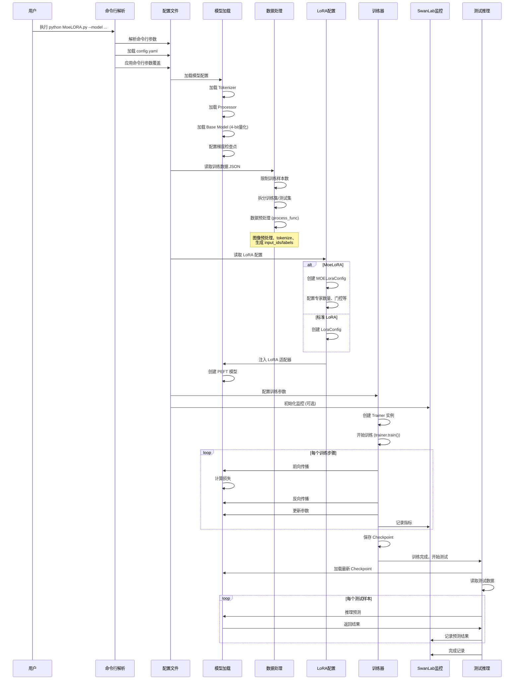
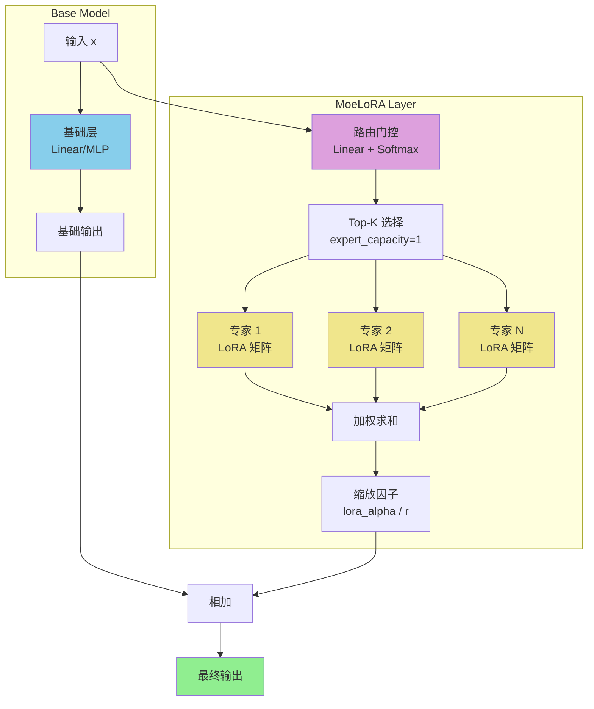
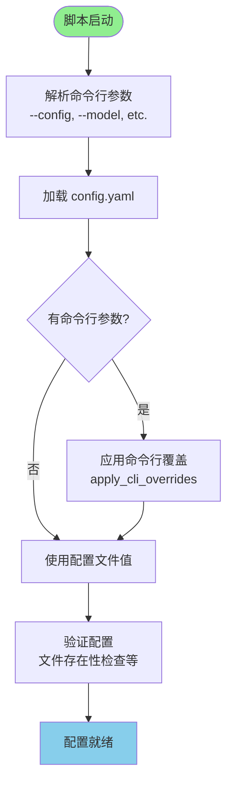

# Qwen3-VL-MoeLoRA 训练流程文档

## 1. 时序图（Sequence Diagram）

## 2. 训练流程框架图（Training Flow Framework）

```mermaid
flowchart TD
    Start([开始执行脚本]) --> ParseCLI[解析命令行参数]
    ParseCLI --> LoadConfig[加载 YAML 配置文件]
    LoadConfig --> ApplyOverrides[应用命令行参数覆盖]
    
    ApplyOverrides --> InitQuant[初始化量化配置<br/>BitsAndBytesConfig]
    InitQuant --> LoadModel[加载基础模型]
    
    LoadModel --> LoadTokenizer[加载 Tokenizer]
    LoadTokenizer --> LoadProcessor[加载 Processor]
    LoadProcessor --> LoadBaseModel[加载 Base Model<br/>AutoModelForImageTextToText]
    LoadBaseModel --> ConfigModel[配置模型参数<br/>use_cache, gradient_checkpointing]
    
    ApplyOverrides --> LoadData[加载训练数据 JSON]
    LoadData --> CheckFile{文件是否存在?}
    CheckFile -->|否| Error1[抛出 FileNotFoundError]
    CheckFile -->|是| LimitData[限制训练样本数]
    LimitData --> SplitData[拆分训练集/测试集]
    SplitData --> SaveSplit[保存 data_vl_train.json<br/>data_vl_test.json]
    SaveSplit --> ProcessData[数据预处理<br/>Dataset.map process_func]
    
    ProcessData --> CreateLoRAConfig{LoRA 类型?}
    CreateLoRAConfig -->|MoeLoRA| MoeLoRAConfig[创建 MOELoraConfig<br/>配置专家数、门控等]
    CreateLoRAConfig -->|标准 LoRA| StandardLoRAConfig[创建 LoraConfig]
    
    MoeLoRAConfig --> InjectAdapter[注入 LoRA 适配器<br/>get_peft_model]
    StandardLoRAConfig --> InjectAdapter
    InjectAdapter --> CreatePEFT[创建 PEFT 模型]
    
    CreatePEFT --> InitSwanLab{SwanLab 启用?}
    InitSwanLab -->|是| SetupSwanLab[初始化 SwanLab<br/>设置回调]
    InitSwanLab -->|否| CreateTrainer
    SetupSwanLab --> CreateTrainer[创建 Trainer<br/>配置训练参数]
    
    CreateTrainer --> StartTraining[开始训练<br/>trainer.train]
    
    StartTraining --> TrainingLoop[训练循环]
    TrainingLoop --> Forward[前向传播]
    Forward --> ComputeLoss[计算损失]
    ComputeLoss --> Backward[反向传播]
    Backward --> UpdateParams[更新参数]
    UpdateParams --> SaveCheckpoint{达到保存步数?}
    SaveCheckpoint -->|是| SaveModel[保存 Checkpoint]
    SaveCheckpoint -->|否| LogMetrics[记录指标到 SwanLab]
    SaveModel --> LogMetrics
    LogMetrics --> CheckEpoch{训练完成?}
    CheckEpoch -->|否| TrainingLoop
    CheckEpoch -->|是| LoadCheckpoint[加载最新 Checkpoint]
    
    LoadCheckpoint --> LoadTestData[加载测试数据]
    LoadTestData --> TestLoop[测试循环]
    TestLoop --> Predict[模型推理]
    Predict --> LogResult[记录预测结果到 SwanLab]
    LogResult --> CheckTest{测试完成?}
    CheckTest -->|否| TestLoop
    CheckTest -->|是| FinishSwanLab[完成 SwanLab 记录]
    FinishSwanLab --> End([结束])
    
    style Start fill:#90EE90
    style End fill:#FFB6C1
    style Error1 fill:#FF6B6B
    style StartTraining fill:#87CEEB
    style TrainingLoop fill:#DDA0DD
    style TestLoop fill:#F0E68C
```

## 3. 数据预处理流程（Data Processing Flow）

```mermaid
flowchart LR
    A[原始 JSON 数据] --> B[读取 conversations]
    B --> C[提取图像路径]
    C --> D[构建 messages 格式]
    D --> E[Processor 处理<br/>图像 + 文本]
    E --> F[Tokenize 文本]
    F --> G[拼接 input_ids]
    G --> H[生成 attention_mask]
    H --> I[生成 labels<br/>-100 掩码]
    I --> J[截断到 MAX_LENGTH]
    J --> K[转换为 Tensor]
    K --> L[返回处理后的数据]
    
    style A fill:#E6F3FF
    style L fill:#90EE90
```

## 4. MoeLoRA 架构图（MoeLoRA Architecture）

## 5. 配置加载流程（Configuration Loading Flow）

## 6. 关键模块说明

### 6.1 配置管理模块
- **命令行参数解析**: 使用 `argparse` 解析用户输入
- **配置文件加载**: 从 YAML 文件加载配置
- **参数覆盖**: 命令行参数优先级高于配置文件
- **点号路径映射**: 参考 LLaMAFactory 风格，使用点号路径访问嵌套配置

### 6.2 模型加载模块
- **量化配置**: 4-bit NF4 量化，降低显存占用
- **模型加载**: 加载 Qwen3-VL-4B-Instruct 基础模型
- **梯度检查点**: 启用以节省显存
- **设备映射**: 自动分配到 GPU

### 6.3 数据处理模块
- **数据读取**: 从 JSON 文件读取对话数据
- **数据预处理**: 
  - 图像路径提取
  - 消息格式构建
  - Tokenization
  - 标签生成（-100 掩码）
- **数据集划分**: 自动拆分训练集和测试集

### 6.4 LoRA/MoeLoRA 模块
- **LoRA 配置**: 支持标准 LoRA 和 MoeLoRA
- **MoeLoRA 特性**:
  - 多个专家 LoRA 层
  - 路由门控机制
  - Top-K 专家选择
- **适配器注入**: 使用 PEFT 框架注入适配器

### 6.5 训练模块
- **训练参数**: 通过 TrainingArguments 配置
- **Trainer**: 使用 HuggingFace Trainer
- **监控**: 集成 SwanLab 进行训练可视化
- **Checkpoint**: 定期保存模型检查点

### 6.6 测试推理模块
- **模型加载**: 从最新 checkpoint 加载
- **批量推理**: 对测试集进行推理
- **结果记录**: 将预测结果记录到 SwanLab

## 7. 性能优化点

1. **4-bit 量化**: 降低显存占用，支持单卡 8G 训练
2. **梯度检查点**: 以时间换显存
3. **梯度累积**: 模拟更大的 batch size
4. **混合精度训练**: FP16/BF16 加速训练
5. **数据预处理缓存**: Dataset.map 自动缓存处理结果

## 8. 扩展点

1. **命令行参数**: 在 `CLI_CONFIG_MAPPING` 中添加新参数映射
2. **LoRA 类型**: 支持更多 LoRA 变体
3. **数据处理**: 扩展 `process_func` 支持更多数据格式
4. **监控工具**: 集成其他监控工具（如 TensorBoard）

